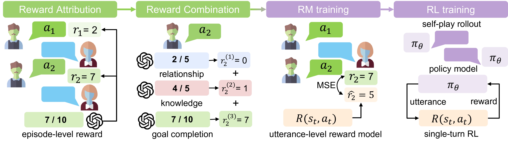

<h1 align="center"> Sotopia-RL: Reward Design for Social Intelligence</h1>

[](https://rl.sotopia.world/)  [](https://huggingface.co/ulab-ai/sotopia-rl-qwen-2.5-7B-grpo) [](https://www.python.org/downloads/release/python-3109/) [](https://pre-commit.com/) <a href="https://github.com/psf/black"></a> 


## 📚 Table of Contents
- [Introduction](#introduction)
- [Step 0 - Environment Setup](#step-0---️-environment-setup)
- [Step 1 - Generating LLM Annotations](#step-1---generating-llm-annotations)
- [Step 2 - Model Training](#step-2---model-training)
  - [Behavior Cloning (SFT)](#21-behavior-cloning-supervised-fine-tuning-sft)
  - [Reward Model Training](#22-reward-model-training)
  - [GRPO Training](#23-grpo-training)
- [Step 3 - Automatic Evaluation](#step-3---automatic-evaluation)

## Introduction

**Sotopia-RL** is an utterance-level, attribution-based, and multi-dimensional social reward design method, trained using single-turn online RL It achieves state-of-the-art performance on social goal completion tasks in the SOTOPIA benchmark.

We first attribute episode-level rewards for multi-turn social interactions to in- dividual utterances with LLMs. Then, we construct a combined reward that includes multiple dimensions of rewards besides goal completion, allowing us to regularize the optimization pro- cess for goal completion. These rewards are used to guide the RL training of social agents.




## Step 0 - 🛠️ Environment Setup

We recommend using `conda` to manage a clean Python environment for `sotopia-rl`.

#### 1. Create and activate the environment

```bash
conda create -n sotopia-rl python=3.10
conda activate sotopia-rl
```

#### 2. Install Poetry (Python package manager)

```bash
curl -sSL https://install.python-poetry.org | python3
export PATH="$HOME/.local/bin:$PATH"
poetry install
```
#### 3. Environment Variables

##### Set Redis URL

A Redis database needs to be set up to connect to a Redis DB for loading and saving environment/session data and run this repo. For detailed instructions of setting up Redis database, please refer to [this tutorial](https://github.com/sotopia-lab/sotopia-pi/tree/main/data_generate#setting-up-redis-database). Make sure to set up Redis OM url in conda environment

```bash
conda env config vars set REDIS_OM_URL="redis://:PASSWORD@server_name:port_num"
```

**Set OpenAI API Key**

```bash
conda env config vars set OPENAI_API_KEY="<your_openai_api_key>"
```

After setting these environment variables, run `conda deactivate && conda activate sotopia-rl` to apply them.


## Step 1 - 🧠 Generating LLM Annotations

To generate LLM annotations, you need to download the original sotopia-pi episodes file from the [huggingface repository](https://huggingface.co/datasets/cmu-lti/sotopia-pi/tree/main) and place it in the `data` folder. Then run the following command:
```
cd scripts/annotate
python process_sotopia_pi.py --data_dir /workspace/sotopia-rl/data --input_file sotopia_pi_episodes.jsonl --output_file sotopia_pi_bc_episodes.jsonl
```
This will generate a new file `sotopia_pi_bc_episodes.jsonl` in the `data` folder.

Then run the following command to generate the LLM annotations:
```
python sample_episodes_and_annotate.py --data_dir /workspace/sotopia-rl/data --llm_name gpt-4o --input_file sotopia_pi_bc_episodes.jsonl --output_file sotopia_pi_bc_episodes_annotated.jsonl
```
The annotations will need to be furuther processed into the format required by the training script. This can be done by running the following command:
```
cd ../data_process
python process_annotation_direct_attribution.py --data_dir /workspace/sotopia-rl/data --input_file sotopia_pi_bc_episodes_annotated.jsonl --reward_output_file sotopia_pi_bc_episodes_reward.json --grpo_output_file sotopia_pi_bc_episodes_grpo.json
```


## Step 2 - 🤖 Model Training

### 2.0 Preparation

Before training, make sure you have configured **Accelerate** correctly. Save your configurations in the following files under `scripts/`:

- `accelerate_config_sft.yaml`
- `accelerate_config_rm.yaml`
- `accelerate_config_grpo.yaml`

All training scripts should be run from the `scripts/` directory.

### 2.1 Behavior Cloning (SFT)

We first collect self-play dialogue data using **GPT-4o** in the SOTOPIA environment. Then we fine-tune a **Qwen2.5-7B-Instruct** model using supervised fine-tuning (SFT) with LoRA.

#### 2.1.1: Data Collection

Conversation data can be collected via Redis.

Use `scripts/data_process/serialize.py` to extract and serialize the logs.

To load data from Redis and save it as `.jsonl`:

```bash
from sotopia.database.logs import EpisodeLog
episode = EpisodeLog.get(pk = 'xxxxx')
episodes_to_jsonl(episodes, "xxxxx.jsonl")
```

#### 2.1.2: Train with Behavior Cloning (SFT)

This command performs supervised fine-tuning using LoRA on Qwen2.5-7B-Instruct.

```bash
export MODEL_PATH="<your_model_path>"
CUDA_VISIBLE_DEVICES=0,1,2,3,4,5,6 accelerate launch \
  --config_file ./accelerate_config_sft.yaml \
  --main_process_port 29512 \
    ./train_sft.py \
    --model_name $MODEL_PATH \
    --learning_rate 1e-4 \
    --max_length 4096 \
    --train_batch_size 2 \
    --val_batch_size 1 \
    --accumulation_steps 8 \
    --num_epochs 500 \
    --use_lora \ # Enable LoRA for parameter-efficient fine-tuning
    --evaluation_steps 5 \ # Evaluate every 5 training steps
    --sft_data_path ../data/sft_data_path.json \
    --template_path ../evals/qwen2.5-7b.jinja \
    --checkpoint_dir ../sft_checkpoints_qwen2.5-7b
```

### 2.2 Reward Model Training

```bash
export MODEL_PATH="<your_model_path>"
CUDA_VISIBLE_DEVICES=0,1,2,3,4,5 accelerate launch \
  --config_file ./accelerate_config_rm.yaml \
  --main_process_port 29500 \
  ./scripts/train_rm.py \
  --model_name $MODEL_PATH \
  --learning_rate 1e-5 \
  --max_length 4096 \
  --train_batch_size 1 \
  --val_batch_size 1 \
  --accumulation_steps 8 \
  --num_epochs 30 \
  --evaluation_steps 50 \
  --reward_data_path ../data/rm_data_path.json \
  --template_path ../evals/qwen2.5-7b.jinja \
  --checkpoint_dir ../rm_checkpoints_qwen2.5-7b
```

### 2.3 GRPO Training

We now use the behavior cloning model to generate self-play dialogues and train the agent using **GRPO(Group Reward Policy Optimization)**

#### 2.3.1: Data Collection

Conversation data can be collected via Redis after running self-play using GPT-4o.

Use `scripts/data_process/serialize.py` to extract and serialize the logs.

To load data from Redis and save it as `.jsonl`:

```bash
from sotopia.database.logs import EpisodeLog
episode = EpisodeLog.get(pk = 'xxxxx')
episodes_to_jsonl(episodes, "xxxxx.jsonl")
```
#### 2.3.2: Training with GRPO

```bash
export MODEL_PATH="<your_model_path>"
CUDA_VISIBLE_DEVICES=0,1,2,3,4,5 accelerate launch \
  --config_file ./accelerate_config_grpo.yaml \
  --main_process_port 29511 \
  ./train_grpo.py \
  --model_name $MODEL_PATH \
  --policy_adapter_path ../sft_checkpoints_qwen2.5-7b/best-checkpoints \
  --reward_adapter_path ../rm_checkpoints_qwen2.5-7b/best-checkpoints \
  --learning_rate 5e-6 \
  --per_device_train_batch_size 4 \
  --per_device_eval_batch_size 4 \
  --gradient_accumulation_steps 8 \
  --grpo_data_path ../data/grpo_data_path.json \
  --template_path ../evals/qwen2.5-7b.jinja \
  --num_grpo_epochs 2 \
  --use_lora_train_grpo \
  --num_generations 16 \
  --output_dir ../grpo_checkpoints
```


## Step 3 - Automatic Evaluation

We first deploy SFT and GRPO model using vllm and, deploy reward model using danjgo, then we evaluate our model based on SOTOPIA-EVAL framework.

For details please see [this section](https://github.com/sotopia-lab/sotopia-rl/tree/main/evals/README.md).
